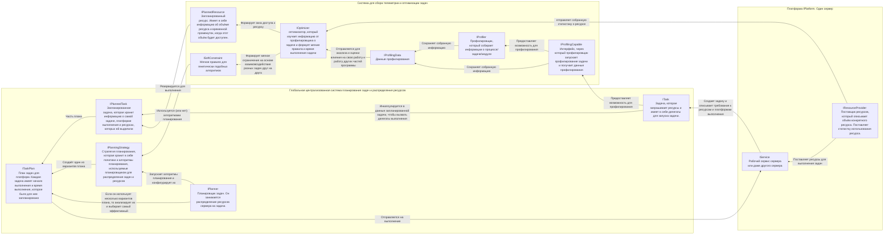

```mermaid
flowchart RL

subgraph IPlatform["Платформа IPlatform. Один сервер"]
    IApp_Service["IService <br> Рабочий сервис сервера или даже другого сервера"]
    IResourceProvider["IResourceProvider <br> Поставщик ресурсов, который описывает объём конкретного ресурса. Поставляет статистку использования ресурса."]
end

subgraph TaskPlaningSystem["Глобальная централизованная система планирования задач и распределения ресурсов"]
    IPlanner["IPlanner <br> Планировщик задач. Он занимается распределение ресурсов сервера на задачи."]
    ITask["ITask <br> Задача, которая запрашивает ресурсы и имеет в себе делегаты для запуска задачи."]
    ITaskPlan["ITaskPlan <br> План задач для платформ. Каждая задача имеет начало выполнения и время выполнения, которое было для нее запланировано"]
    IPlannedTask["IPlannedTask <br> Запланированная задача, которая хранит информацию о самой задаче, платформе выполнения и ресурсах, которых ей выделили"]
    IPlanningStrategy["IPlanningStrategy <br> Стратегия планирования, которая хранит в себе политики и алгоритмы планирования, используемые планировщиком для распределения задач и ресурсов"]
end

subgraph OptimizingSystem["Система для сбора телеметрии и оптимизации задач"]
    IOptimizer["IOptimizer <br> оптимизатор, который изучает информацию от профилировщика о задаче и формует мягкие правила и время выполнения задачи"]
    IProfiler["IProfiler <br> Профилировщик, который собирает информации о процессе/задаче/модуле"]
    IProfilingCapable["IProfilingCapable <br> Интерфейс, через который профилировщик запускает профилирование задачи и получает данные профилирования"]
    IPlannedResource["IPlannedResource <br> Запланированный ресурс. Имеет в себе информацию об объёме ресурса и временной промежуток, когда этот объём будет доступен."]
    ISoftConstraint["ISoftConstraint <br> Мягкое правило для генетически подобных алгоритмов"]
    IProfilingData["IProfilingData <br> Данные профилирования"]
end

IApp_Service --> |" Создает задачу и описывает требования к ресурсам и платформам выполнения "| ITask
ITask --> |" Инкапсулируется в данные запланированной задачи, чтобы вызвать делегаты выполнения "| IPlannedTask
IPlannedTask --> |" Часть плана "| ITaskPlan
IResourceProvider --> |" Поставляет ресурсы для выполнения задач "| IApp_Service
IResourceProvider --> |" отправляет собранную статистику о ресурсе "| IOptimizer
IOptimizer --> |" Формирует окна доступа к ресурсу "| IPlannedResource
IPlannedResource --> |" Резервируется для выполнения "| IPlannedTask
IOptimizer --> |" Формирует мягкое ограничения на основе взаимовоздействия разных задач друг на друга "| ISoftConstraint
ISoftConstraint --> |" Используется (или нет) алгоритмами планирования "| IPlanningStrategy
IPlanningStrategy --> |" Создаёт один из вариантов плана "| ITaskPlan
IPlanner --> |" Если он использует несколько вариантов плана, то анализирует их и выбирает самый эффективный "| ITaskPlan
ITaskPlan --> |" Отправляется на выполнение "| IApp_Service
ITask --> |" Предоставляет возможность для профилирования "| IProfilingCapable
IProfilingCapable --> |" Предоставляет возможность для профилирования "| IProfiler
IProfilingData --> |" Отправляется для анализа и оценки влияния на свою работу и работу других частей программы "| IOptimizer
IProfiler --> |" Сохраняет собранную информацию "| IProfilingData
IProfilingCapable --> |" Сохраняет собранную информацию "| IProfilingData
IPlanner --> |" Запускает алгоритмы планирования и конфигурирует их "| IPlanningStrategy

```
